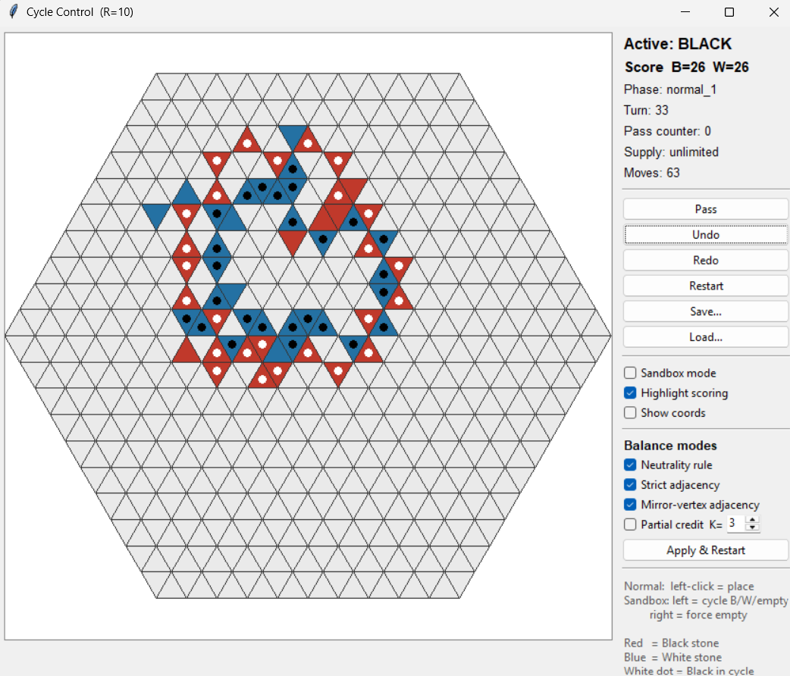

# Cycle Control (Graph Version) — Research Prototype

Deterministic research engine for the Cycle Control two-player abstract strategy game.

## Why this is interesting

This project is not just a playable game prototype. It is a deterministic rule engine for testing a new abstract strategy game, including graph-based scoring, AI hooks, ELO evaluation, tournament simulation, persistence, and automated tests.

The main technical focus is making the game rules precise, testable, and suitable for bot-vs-bot experimentation.

## Game summary
Two players (Black, White) place stones on triangular cells of a hex-shaped board region. A stone scores for its owner iff the triangle it occupies belongs to at least one simple cycle in that player's induced subgraph (adjacent same-color stones). The player with more scoring nodes at game end wins.

## Screenshot



## Layout
```
cycle_control/
    __init__.py         re-exports the public API
    topology.py         (q, r, o) coords, adjacency, on-board predicate
    rules.py            RulesConfig + validation
    state.py            GameState, Player, NodeState, TurnPhase, history entries
    engine.py           MoveEngine (legality, placement, pass, undo/redo, sandbox)
    scoring.py          Tarjan-bridge-based scoring
    persistence.py      JSON save/load with schema_version
    testrunner.py       JSON-driven test runner + CLI entry point
    ai_hooks.py         bot hooks (legal_moves, clone, apply_move, evaluate, BotRNG)
    debug.py            analysis helpers (connected components, summary)

tests_builtin.py        unittest suite (68 tests)
tests/
    test_basic.json     example JSON tests (7 tests)
ui.py                   Tkinter UI (analytical, not pretty)
README.md               this file
```

## Quick start
```
# run unit tests
python -m unittest tests_builtin.py

# run JSON-based tests
python -m cycle_control.testrunner tests/test_basic.json

# run UI (radius-3 default)
python ui.py
python ui.py 2          # radius-2 board
```

Requires Python 3.10+. Tkinter is needed for the UI (bundled with standard CPython distributions).

## Coordinate system
Each triangular cell is identified by `(q, r, o)`:
- `q, r`: axial integer coordinates
- `o ∈ {0, 1}`: orientation (0 = up triangle, 1 = down triangle)

Adjacency (fixed):
- `(q, r, 0)` neighbors: `(q, r, 1), (q-1, r, 1), (q, r-1, 1)`
- `(q, r, 1)` neighbors: `(q, r, 0), (q+1, r, 0), (q, r+1, 0)`

Because every edge crosses the `o` bit, the graph is bipartite — therefore its girth is even. The minimum realizable cycle length is 6.

On-board predicate: a triangle is on board iff all 3 of its corner vertices `(a, b)` satisfy `max(|a|, |b|, |a+b|) <= radius`. This yields exactly `6 * radius**2` on-board triangles.

## Scoring method
Tarjan's bridge algorithm, iterative (no recursion). A node scores iff it has at least one non-bridge incident edge in its owner's induced subgraph. Equivalently: the node belongs to a block (biconnected component) with at least 2 edges. Every block with at least 2 edges contains a cycle.

Worst case `O(V + E)` per player per evaluation.

## Rules configuration (see `rules.py`)
- `board_radius` (int, default 3)
- `stones_per_player` (int or None; None = unlimited supply)
- `pass_enabled` (bool)
- `end_on_consecutive_passes` (bool)
- `end_on_all_stones_placed` (bool) — requires supply enabled
- `end_on_board_full` (bool)

### Experimental balance modes (all default off)
Each mode is independent and can be combined freely. Toggle in the UI via the "Balance modes" checkboxes, then click "Apply & Restart". Also configurable in JSON test specs via the `rules` block.

- **`neutrality_rule`** — at the target cell, placer's own-neighbor count must be `>= opponent's` neighbor count. Trivially satisfied in empty regions (0 >= 0). Prevents deep parachute-blocks into opponent territory.
- **`strict_adjacency_rule`** — placement must be adjacent to at least one of placer's own stones. Suspended automatically while placer has zero stones on the board (needed for opening + each side's first placement). Stronger than neutrality.
- **`mirror_adjacency`** — adds edges between opposite-orientation triangles that share a single vertex (point-reflection). Increases degree from 3 to 6 for interior cells; drops girth from 6 to 4. Graph remains bipartite by orientation. Enables shorter cycles and combinatorial redundancy for attackers.
- **`partial_credit_k`** (int, 0 = off) — in addition to cycle-nodes, award points to all nodes in any connected component of size `>= k`. Final scoring set is the union.

Validation rejects:
- no end conditions enabled
- `end_on_all_stones_placed` with supply disabled
- `end_on_consecutive_passes` as the sole enabled end condition with `pass_enabled = false`

## Turn structure
- Opening (Black): exactly 1 placement, then pass or game may end
- Normal turn: up to 2 placements, may also pass
- Turn phase is computed once at turn start from pre-turn state (supply left, empty cells) and is NOT recomputed mid-turn. Phases: `opening`, `normal_1`, `normal_2`, `truncated_1`
- Consecutive-pass counter: incremented only by full-turn passes (0 placements first), reset by any placement. Partial passes after placements do NOT increment the counter.
- End conditions are checked after every action, before turn advancement.

## Undo / redo
- `undo()` reverts exactly ONE action (placement or pass).
- Undo implementation: replay from `initial_state()` through `move_history[:-1]`. Simple and correct by construction.
- Existing redo stack is preserved on undo; the newly undone action is pushed on top.
- Any new placement or pass clears the redo stack.
- `current_turn` is stored in state; it decreases on undo when a turn boundary is crossed.
- Sandbox actions are NOT in `move_history` and are NOT reproduced by replay; using `undo()` after sandbox operations will therefore lose the sandbox edits.

## Sandbox
`sandbox_place(state, node, color)` and `sandbox_remove(state, node)` bypass all turn/supply rules. They do NOT touch: move history, turn phase, active player, pass counter, supply, `game_over`, `winner`. `assert_move_count` excludes sandbox actions.

## Persistence
JSON format with `schema_version` (currently 1). `redo_stack` is NOT persisted. Loader raises `PersistenceError` on schema mismatch or missing required fields.

## AI hooks (`ai_hooks.py`)
- `legal_moves(engine, state)` → list of legal placement nodes
- `clone(state)` → deep copy of state
- `apply_move(engine, state, move)` where `move = {"type": "place", "node": ...}` or `{"type": "pass"}`
- `evaluate(engine, state, player)` → `{"own": int, "opponent": int, "diff": int}`
- `BotRNG(seed)` — per-bot RNG (not global)

## JSON test format
See `tests/test_basic.json`. Supported commands:

Actions: `place`, `pass`, `sandbox_place`, `sandbox_remove`, `undo`, `redo`, `snapshot` (no-op), `snapshot_board` (no-op)

Assertions: `assert_score`, `assert_active_player`, `assert_turn_phase`, `assert_turn_number`, `assert_move_count`, `assert_game_over`, `assert_winner`, `assert_node_state`, `assert_scoring_node`, `assert_not_scoring_node`, `assert_stones_remaining`, `assert_pass_counter`, `assert_legal_moves`

Unknown commands cause the test to FAIL AND STOP.

## UI
Tkinter-based. Analytical, not aesthetic:
- Left-click: place stone (normal) or cycle empty → Black → White → empty (sandbox)
- Right-click (sandbox mode only): force empty
- Toggles: sandbox mode, highlight scoring nodes, show (q, r, o) coords
- Buttons: Pass, Undo, Redo, Restart, Save, Load
- Scoring indicator: red dot (Black cycles), blue dot (White cycles)

## Known limitations
1. Sandbox + undo: the initial state is re-derived from `initial_state()`, so any sandbox edits made before a sequence of normal moves will NOT survive `undo()`. Use sandbox for position setup, then don't expect undo to preserve it.
2. Pathological rules combinations (e.g. supply enabled, pass disabled, `end_on_all_stones_placed` disabled, `end_on_board_full` disabled if unreachable on a small board) are not detected at config time — the game will simply stall. Existing validation catches the common unreachable combinations specified in v5.
3. Girth check in `BoardTopology` is `O(V * (V+E))`; on very large boards (radius 15+) construction is slow. It's a one-time construction cost.
